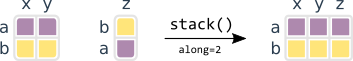
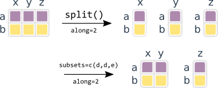
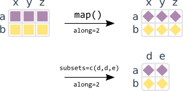
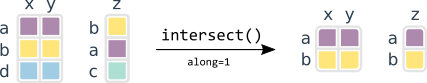
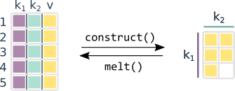

```{css echo=FALSE}
img {
    border: 0px !important;
    margin: 2em 2em 2em 2em !important;
}
```

```{r setup, echo=FALSE, results='hide', warning=FALSE, error=FALSE, message=FALSE, cache=FALSE}
library(knitr)
opts_chunk$set(
  cache = FALSE,
  echo = TRUE,
  warning = FALSE,
  error = FALSE,
  message = FALSE,
  out.width = 700,
  fig.width = 12,
  fig.height = 8,
  dpi = 84,
  concordance = TRUE,
  collapse = TRUE,
  comment = "#>"
)

library(narray)
```

Loading the package
-------------------

This package provides consistent utility functions for array programming with
arbitrary dimensions (summary below).

We recommend to load this package in its own namespace to not shadow base R
functions using [`box`](https://github.com/klmr/box) or
[`import`](https://github.com/rticulate/import).

```{r namespace, eval=FALSE}
# example referencing the package namespace
# do not load the package with 'library(...)' here
narray::stack(...)
```

Stacking and splitting
----------------------

`stack()` is like `cbind`/`rbind`, but along arbitrary axes, and taking care of (1) names
along each dimension and (2) padding partial matching arrays.



```{r stack}
A = matrix(1:4, nrow=2, ncol=2, dimnames=list(c('a','b'),c('x','y')))
B = matrix(5:6, nrow=2, ncol=1, dimnames=list(c('b','a'),'z'))

C = stack(A, B, along=2)
C

D = stack(m=A, n=C, along=3) # we can also introduce new dimensions
D
```

`split()` splits an array along a given axis; can do each element or defined subsets.



```{r split}
split(C, along=2, subsets=c('s1','s1','s2'))
```

Mapping functions on arrays
---------------------------

Like `apply`, but not reordering array dimensions and allowing to specify
subsets that the function should be applied on. The function must either return
a vector of the same length as the input (returns matrix of same dimension) or
of length 1 (drops current dimension or returns subsets).



```{r map}
map(C, along=2, function(x) x*2) # return same length vector
map(C, along=2, mean, subsets=c('s1', 's1', 's2')) # summarize each subset to scalar
```

We can also index multiple arrays using the `lambda` function. If the result
is a scalar we will get back an array, and an index with result column otherwise.

```{r lambda}
dot = function(x, y) sum(x * y)
lambda(~ dot(A, B), along=c(A=1, B=2))
lambda(~ dot(A, B), along=c(A=1, B=2), simplify=FALSE)
```

Intersecting
------------

Takes a number of arrays, intersects their names along a given dimension,
and returns sub-arrays that match in their names; `intersect_list` takes
a list of arrays and returns a list of subsets.



```{r intersect}
E = matrix(1:6, nrow=3, dimnames=list(c('a','b','d'), c('x','y')))
F = matrix(7:9, nrow=3, dimnames=list(c('b','a','c'), 'z'))

intersect(E, F, along=1)
E
F
```

Converting to and from `data.frame`s
------------------------------------

`construct()` takes a data frame and a formula specifying dependent (values) and independent
(axes) of the resulting array.



```{r construct}
DF = data.frame(k1=base::rep(letters[1:3],2),
                k2=base::rep(letters[24:25],3), v=1:6)[-6,]
construct(v ~ k1 + k2, data=DF)
```

Masks from factors and lists
----------------------------

Takes either a factor or a list of vectors and creates a binary matrix
specifying whether each element is present.


```{r mask}
G = list(a='e1', b=c('e1','e2'), c='e2')
mask(G)
```
